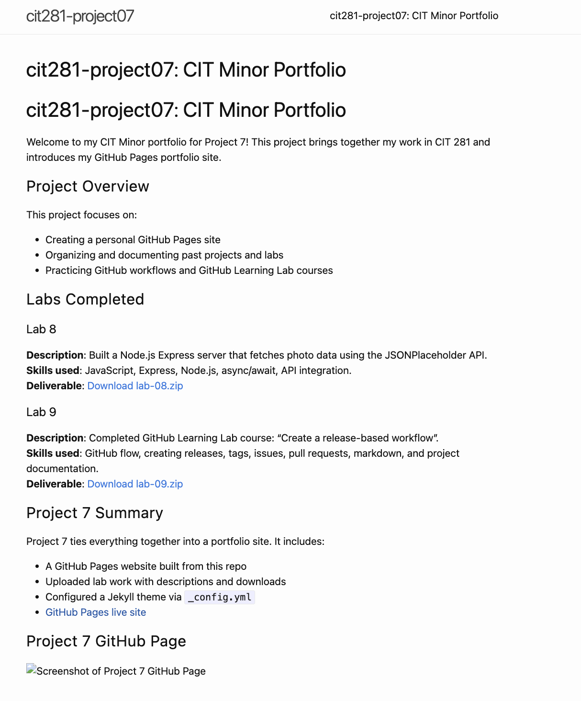

# cit281-project07: CIT Minor Portfolio

Welcome to my CIT Minor portfolio for Project 7! This project brings together my work in CIT 281 and introduces my GitHub Pages portfolio site.

## Project Overview

This project focuses on:

- Creating a personal GitHub Pages site
- Organizing and documenting past projects and labs
- Practicing GitHub workflows and GitHub Learning Lab courses

## Labs Completed

### [Lab 8](lab-08.zip)
**Description**: Built a Node.js Express server that fetches photo data using the JSONPlaceholder API.  
**Skills used**: JavaScript, Express, Node.js, async/await, API integration.  
**Deliverable**: [Download lab-08.zip](./lab08.zip)

### [Lab 9](lab-09.zip)
**Description**: Completed GitHub Learning Lab course: “Create a release-based workflow”.  
**Skills used**: GitHub flow, creating releases, tags, issues, pull requests, markdown, and project documentation.  
**Deliverable**: [Download lab-09.zip](./lab09.zip)

## Project 7 Summary

Project 7 ties everything together into a portfolio site. It includes:
- A GitHub Pages website built from this repo
- Uploaded lab work with descriptions and downloads
- Configured a Jekyll theme via `_config.yml`
- [GitHub Pages live site](https://sionadhaliwal.github.io/cit281-project07)

## Project 7 GitHub Page

